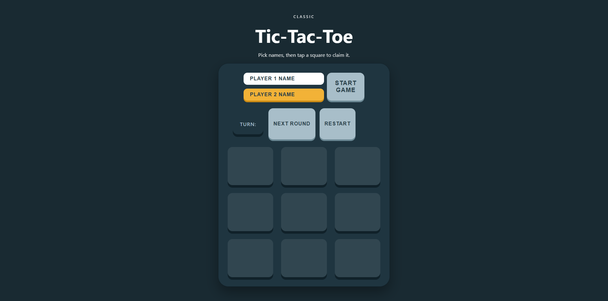

# Tic-Tac-Toe Game 

# 📄 Descrição
Jogo clássico de Tic-Tac-Toe (Jogo da Velha) desenvolvido com JavaScript vanilla.

# 💻 Sobre o projeto
Tic-Tac-Toe Game é um projeto desenvolvido como parte do currículo do The Odin Project para praticar conceitos avançados de JavaScript, focando em organização de código e design patterns.

O desafio consistiu em criar um jogo da velha funcional implementando os padrões Module Pattern e Factory Pattern, garantindo encapsulamento de dados e separação de responsabilidades entre lógica do jogo e interface do usuário.

# ⚙️ Funcionalidades
- Cadastro de nomes personalizados para jogadores (Player 1 e Player 2)

- Alternância automática de turnos entre jogadores

-  Detecção de vitória com 8 condições possíveis

- Detecção de empate quando o tabuleiro está completo

- Indicador visual de turno e resultado do jogo

- Botão "Next Round" para nova partida mantendo jogadores

- Botão "Restart" para resetar jogo e cadastrar novos jogadores

- Marcadores visuais diferenciados (X e O)

- Validação de jogadas (não permite marcar células ocupadas)

# 🎨 Layout
Interface clean e minimalista com:

Header com título e instruções

Formulário de cadastro de jogadores

Tabuleiro 3x3 interativo

Display de status mostrando turno atual ou resultado

Botões de controle (Next Round e Restart)

 

# 🚀 Como executar o projeto
1. Clonar o repositório
```bash
https://github.com/henrymzs/tic-tac-toe.git
cd tic-tac-toe
```

2. Executar o projeto
Com Live Server (VSCode)
Clique com botão direito no index.html → "Open with Live Server"

# 🛠 Tecnologias
As seguintes ferramentas foram usadas na construção do projeto:
Front-End
- HTML5 - Estrutura semântica

- CSS3 - Estilização e responsividade

- JavaScript (ES6+)
    - Module Pattern (IIFE)
    - Factory Pattern
    - DOM Manipulation
    - Event Handling
    - Arrow Functions

# 🏗 Padrões utilizados
Module Pattern (IIFE)
Usado para encapsular lógica e criar privacidade de dados:
- Gameboard - Gerencia estado do tabuleiro

- GameController - Controla lógica do jogo

- displayController - Gerencia interface e eventos DOM

Factory Pattern
Usado para criar objetos jogadores dinamicamente:
```bash
function createPlayer(name, marker)
```

Separation of Concerns
- Lógica do jogo separada da apresentação visual

- Cada módulo tem uma responsabilidade única

# 💪 Como contribuir para o projeto
1. Faça um fork do projeto

2. Crie uma branch para sua feature:
```bash
git checkout -b feature/minha-feature
```

3. Commit suas mudanças:
```bash
git commit -m "feat: Adiciona minha feature"
```

4. Push para a branch:
```bash
git push origin feature/minha-feature
```

5. Abra um Pull Request

# 🦸 Autor

[](https://github.com/henrymzs)
[](https://linkedin.com/in/henry-kaua)
[](mailto:henrykaua21@gmail.com)